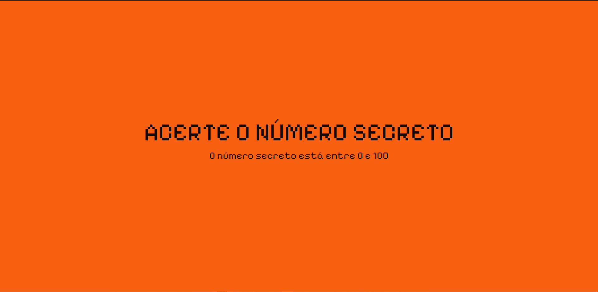
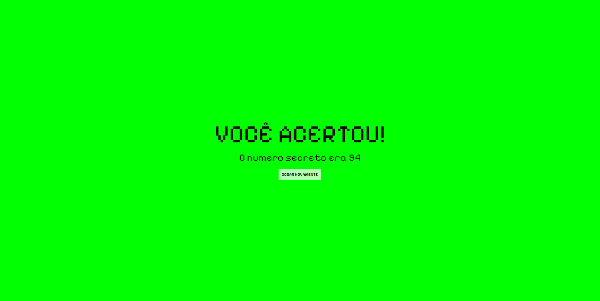
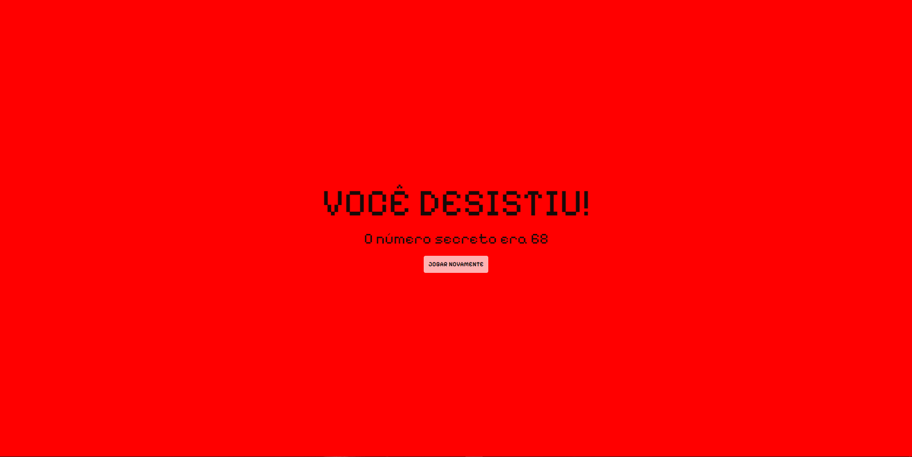

<h1 style="font-weight: 700;">Jogo do número secreto</h1>

Jogo do número secreto, utilizando reconhecimento de voz através da API 'Web Speech'. Projeto do Curso da Alura

 
<h2 style="font-weight: 500;">Tela principal</h2>

<h2 style="font-weight: 500;">Acertando o número</h2>

<h2 style="font-weight: 500;">Desistindo de adivinhar</h2>

Falando a palavra "Desisto", acontece uma mudança na tela principal e é ativado uma áudio indicando que o usuário desistiu do jogo.

## 📦Tecnologias usadas:

Projeto desenvolvido com as seguintes tecnologias:

- 
- 
- 
- Consumo de API

## 💻Projeto Finalizado
Acesse aqui: https://jogo-de-adivinhacao-alpha.vercel.app/
